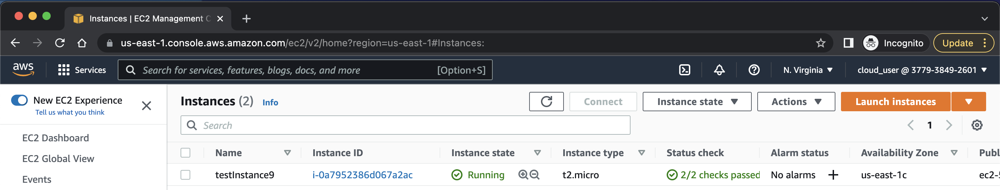

# TF-Deployment

Decoupling the communication between terraform client and server with RabbitMQ, Terraform CDK and Go. Provision infrastructure at scale.

In this example, we will see how consumers create AWS EC2 instances using configs from producer's messages.



# Prerequisite

- Docker/Docker-compose
- cdktf-cli
- terraform
- Go >= 1.16

# Quick Start

Start rabbitMQ:

```bash
docker compose up
```

Download/generate modules and providers

```bash
cd tf-deployment
cdktf get
```

Start terraform consumer:

```bash
cd tf-deployment
go run main.go
```

Start terraform producer:

```bash
cd tf-client
go run main.go <ec2-instance-name>
```
